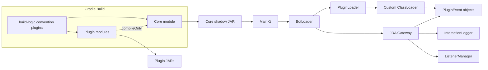
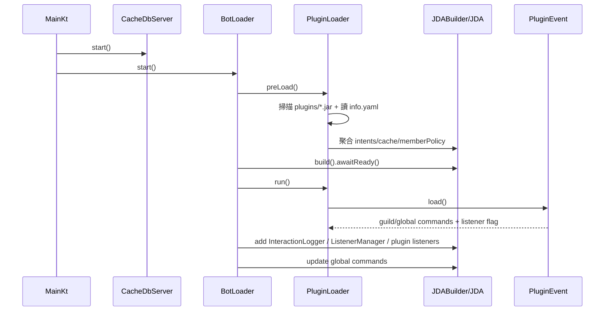
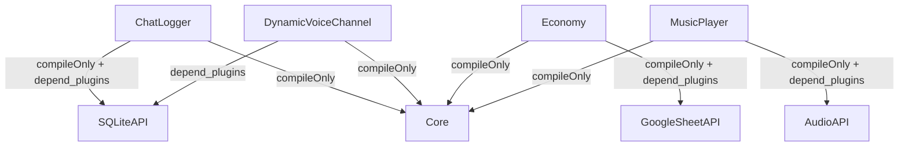

# PROJECT_CONTEXT

> 本文件依據程式碼實作建立（`README.md` 僅作旁證，不作為事實來源）。
> 分析時間：2026-02-15。

## 1) Architecture Overview

### 1.1 Core / Plugin 總體關係

### 1.2 啟動與生命週期

### 1.3 Discord 事件流（Event Bus 現況）
- 沒有額外自製 Event Bus；實際上是 **JDA ListenerAdapter 廣播模型**。
- 每個 Plugin 的 `Event` 物件直接繼承 `PluginEvent`（其本身繼承 `ListenerAdapter`）。
- Core 在 `BotLoader.start()` 直接把 plugin listener 註冊進 JDA：
  - `addEventListener(ListenerManager(...))`
  - `PluginLoader.listenersQueue.forEach { addEventListener(it) }`

## 2) Build Logic & Dependency Graph

## 2.1 `build-logic`（Convention Plugins）

### `xs-jvm-conventions`
路徑：`build-logic/convention/src/main/kotlin/xs-jvm-conventions.gradle.kts`

實作重點：
- 強制 Java/Kotlin toolchain 21。
- 依 root `gradle.properties` + module `gradle.properties` 組合版本：
  - `coreApi = version.major.version.minor`
  - `version = major.minor.patch[-SNAPSHOT]`
- 生成 `tw.xinshou.discord.common.Version`（含 `VERSION`, `CORE_API`, `BUILD_TIME`）。
- `processResources` 會對 `info.yaml/info.yml` 做 token expand：
  - `${author}`, `${name}`, `${coreApi}`, `${version}`
- 統一 Jar manifest（Implementation-Version、X-Core-Api 等）。

### `xs-plugin`
路徑：`build-logic/convention/src/main/kotlin/xs-plugin.gradle.kts`

實作重點：
- 套用 `xs-jvm-conventions`。
- 自動加入 `compileOnly(project(":Core"))`。
- `build` 依賴 `jar`。
- 輸出 jar 到 `${rootProject.extra["outputPath"]}/plugins`。

### `xs-plugin-shadow`
路徑：`build-logic/convention/src/main/kotlin/xs-plugin-shadow.gradle.kts`

實作重點：
- 與 `xs-plugin` 相同，但改為 `build` 依賴 `shadowJar`。
- 適用需要把第三方 runtime 依賴打進 plugin jar 的插件。

## 2.2 `libs.versions.toml` 與 `settings.gradle.kts`

### 版本與依賴來源
- 路徑：`gradle/libs.versions.toml`
- 所有 plugin/core 共用版本 catalog（JDA、kotlin、shadow、mongo、kaml 等）。

### 模組註冊與依賴管理
- 路徑：`settings.gradle.kts`
- 使用 `includeBuild("build-logic/convention")` 注入 convention plugins。
- `dependencyResolutionManagement` 使用 `RepositoriesMode.PREFER_PROJECT` + `mavenCentral()`。
- 顯式 include：`Core` + 20 個 Plugin 模組（含 API 子模組）。

## 2.3 依賴隔離策略（實際行為）

### 編譯期
- Plugin 對 Core：統一 `compileOnly(:Core)`（由 convention 自動加）。
- Plugin 對 Plugin API：由各 plugin 自行宣告 `compileOnly(project(...))`，例如：
  - `ChatLogger -> SQLiteAPI`
  - `Economy -> GoogleSheetAPI`
  - `MusicPlayer -> AudioAPI`

### 執行期
- 所有 plugin jar 透過同一個 `tw.xinshou.discord.core.plugin.ClassLoader` 載入。
- 因為是單一 ClassLoader，插件之間並非強隔離（class/resource namespace 可能互相影響）。

### runtime plugin 依賴（`info.yaml` 的 `depend_plugins`）
- `ChatLogger -> SQLiteAPI`
- `DynamicVoiceChannel -> SQLiteAPI`
- `Economy -> GoogleSheetAPI`
- `MusicPlayer -> AudioAPI`

## 2.4 模組依賴圖（高價值邊）

## 3) Core Architecture（關鍵）

### 3.1 Plugin Loading Strategy
路徑：`Core/src/main/kotlin/core/base/PluginLoader.kt`

流程：
1. 掃描 `./plugins/*.jar`。
2. 每個 jar 讀取 `info.yaml`（KAML -> `InfoSerializer`）。
3. 驗證 plugin name 不重複。
4. `ClassLoader.addJar(path, mainClass)` 把 jar 註冊到自訂 URLClassLoader。
5. 讀取 `main` class，要求可反射取得 Kotlin `object` 的 `INSTANCE`。
6. 依 `depend_plugins` / `soft_depend_plugins` 做遞迴排序，加入 `pluginQueue`。
7. 聚合所有 plugin 的 `require_intents` / `require_cache_flags` / `require_member_cache_policies`。

技術特徵：
- 載入方式是 **Reflection + Kotlin object INSTANCE**，非 ServiceLoader、非 DI Container。
- 若 `main` 不是 Kotlin object，`INSTANCE` 反射會失敗。

### 3.2 自訂 ClassLoader 行為
路徑：`Core/src/main/kotlin/core/plugin/ClassLoader.kt`

重點：
- 每個 plugin 以 `main` class package 當 key（如 `tw/xinshou/discord/plugin/ticket`）。
- `findResource` 會把「相對於 package 的資源查詢」重新映射到 jar root。
- 這使 `PluginEvent` 內 `javaClass.getResource("lang")`、`getResource("config.yaml")` 可對應到資源根目錄。

### 3.3 Lifecycle Management

進入點：`Core/src/main/kotlin/core/Main.kt`
- `main()` 依序：
  - `LogBackManager.configureSystem()`
  - `Arguments.parse(args)`
  - `CacheDbServer.start()`
  - `BotLoader.start()`
  - `JLineManager.start(...)`
- finally：`CacheDbServer.close()`、`BotLoader.stop()`、`JLineManager.stop()`。

`BotLoader.start()`（`Core/src/main/kotlin/core/base/BotLoader.kt`）
- `UpdateChecker.versionCheck()`（目前程式碼被 `|| true` 永遠忽略更新檢查）。
- `SettingsLoader.run()` 載入 `./config.yaml`。
- `PluginLoader.preLoad()` 先收集插件需求，再建立 JDA。
- JDA 初始化：
  - 固定 intents: `GUILD_MEMBERS`, `SCHEDULED_EVENTS`, `GUILD_EXPRESSIONS`
  - 再加上 plugin 聚合 intents/cache/member policy
- `PluginLoader.run()` 執行各插件 `load()` 並收集 commands。
- 註冊 listeners + commands：
  - `InteractionLogger`
  - `ListenerManager`
  - plugin listeners
  - `updateCommands()` 註冊 global commands

`BotLoader.reload()`
- 只做 `PluginLoader.reload()` + `SettingsLoader.run()` + `StatusChanger.run()`。
- 不會重建 JDA，也不會重做 intent/cache 設定。

`BotLoader.stop()`
- 移除 listener、shutdown JDA。
- 依 `pluginQueue.reversed()` 呼叫 `plugin.unload()`。

### 3.4 Event Dispatch

實際 dispatch 鏈：
1. Discord Gateway -> JDA Event。
2. JDA 依 listener 註冊序呼叫。
3. `InteractionLogger` 會對 SlashCommand 先 `deferReply(true)`。
4. 各 plugin `Event` 物件自行在 `onSlashCommandInteraction/onButton...` 做 command/component id routing。

## 4) Data Flow & State

### 4.1 Core/Plugin 設定檔流

Core 設定：
- `SettingsLoader` 載入根目錄 `./config.yaml`（不存在會從 Core resources 匯出）。

Plugin 設定：
- `PluginEventConfigure<C>` 在 `load()/reload()` 自動讀 `plugins/<pluginName>/config.yaml`。
- 若不存在，透過 `FileGetter` 從 plugin jar 匯出預設 `config.yaml`。

語系資源：
- `PluginEvent.load()` 會嘗試匯出 `lang/` 到 `plugins/<pluginName>/lang/...`。
- `StringLocalizer` 掃描 `lang/<discord-locale>/...` 並建立 key-localization map。

### 4.2 共享資源存取模式

MongoDB（Embedded）
- `CacheDbServer` 啟動內嵌 Mongo，資料目錄 `./mongodb-data`。
- 插件用 `CacheDbManager(pluginName).getCollection(...)` 取 `ICacheDb`。
- `MemoryCacheDb`：啟動讀全量到記憶體，寫入非同步回刷 DB。
- `DirectCacheDb`：每次操作直接非同步寫 DB。

JSON 檔案
- `JsonFileManager<T>`：單檔 JSON（Moshi）。
- `JsonGuildFileManager<T>`：以 guildId.json 分片。

模板與 placeholder
- `MessageCreator` / `ModalCreator` 讀 yaml 模板產生 JDA payload。
- `Placeholder` + `Substitutor` 提供 bot/user/member/interaction 動態變數。
- `ComponentIdManager` 提供可逆的 componentId 編碼/解碼（含 INT/LONG hex 壓縮）。

Plugin API 插件（跨插件共享）
- `SQLiteAPI`：`SQLiteFileManager` 連線池。
- `GoogleSheetAPI`：`SheetsService` OAuth + Sheets client。
- `AudioAPI`：提供語音相關依賴基底。

## 5) Key Interfaces（開發 Plugin 必備）

### 5.1 必備抽象類別
- `PluginEvent`
  - 路徑：`Core/src/main/kotlin/core/plugin/PluginEvent.kt`
  - 角色：Plugin 基底 listener；提供 `load/unload/reload`、`guildCommands/globalCommands`。
- `PluginEventConfigure<C>`
  - 路徑：`Core/src/main/kotlin/core/plugin/PluginEvent.kt`
  - 角色：在 `load/reload` 自動讀取 typed config (`config.yaml`)。

### 5.2 Plugin 描述檔模型
- `InfoSerializer`
  - 路徑：`Core/src/main/kotlin/core/plugin/yaml/InfoSerializer.kt`
  - `info.yaml` 重要鍵：
    - `main`, `name`, `coreApi`, `version`
    - `require_intents`, `require_cache_flags`, `require_member_cache_policies`
    - `depend_plugins`, `soft_depend_plugins`

### 5.3 常用 Core API（Plugin 內高頻）
- `StringLocalizer`：`Core/src/main/kotlin/core/localizations/StringLocalizer.kt`
- `MessageCreator`：`Core/src/main/kotlin/core/builtin/messagecreator/MessageCreator.kt`
- `ModalCreator`：`Core/src/main/kotlin/core/builtin/messagecreator/ModalCreator.kt`
- `ComponentIdManager`：`Core/src/main/kotlin/core/util/ComponentIdManager.kt`
- `CacheDbManager` / `ICacheDb`：`Core/src/main/kotlin/core/mongodb/*`
- `JsonFileManager` / `JsonGuildFileManager`：`Core/src/main/kotlin/core/json/*`

## 6) Dependency Rules（新 Plugin 開發規範）

### 6.1 Gradle 設定
1. 在 `settings.gradle.kts` 加入 module include。
2. module `build.gradle.kts` 套用：
   - 無外部 runtime 依賴：`id("xs-plugin")`
   - 需打包外部 runtime 依賴：`id("xs-plugin-shadow")`
3. module `gradle.properties` 至少設定 `version.patch`。

### 6.2 Core / Plugin API 依賴規則
- Core 依賴由 convention 自動加 `compileOnly(:Core)`，不要手動重複。
- 需用 API plugin 類別時，顯式加 `compileOnly(project(...))`。
- 若 runtime 上需要先載入其他 plugin，必須在 `info.yaml` 寫 `depend_plugins`。
- `compileOnly` 與 `depend_plugins` 目前是兩套機制，需手動保持一致。

### 6.3 `info.yaml` 與主類要求
- `main` 必須指向 **Kotlin object**（因 Loader 用 `INSTANCE` 反射）。
- `name` 決定 plugin runtime 目錄：`plugins/<name>`。
- `require_*` 會被 Core 聚合到 JDA 啟動參數。

### 6.4 資源與檔案慣例
- 建議放置：
  - `src/main/resources/info.yaml`
  - `src/main/resources/config.yaml`
  - `src/main/resources/lang/...`
- 若使用 `StringLocalizer`，需提供 defaultLocale 對應語系檔。

## 7) Current Implementation Summary

## 7.1 Core 已實作能力
- 啟動框架：CLI 參數、JLine console、Logback/Jansi。
- Discord 連線：JDA 初始化 + plugin 需求聚合 intents/cache policies。
- 插件框架：jar 掃描、依賴拓樸處理、反射實例化、生命週期呼叫。
- 指令註冊：guild/global command 收集與註冊。
- 內建工具：
  - `StatusChanger`
  - `ConsoleLogger`
  - `InteractionLogger`
  - `MessageCreator` / `ModalCreator`
  - `Placeholder` / `ComponentIdManager`
- 資料層：Embedded Mongo (`CacheDbServer`)、JSON 管理器。

## 7.2 Plugins 現況（可作為範例）

### API Plugins
- `AudioAPI`：語音庫提供者（listener=false）。
- `SQLiteAPI`：SQLite JDBC 載入 + 連線管理（listener=false）。
- `GoogleSheetAPI`：Google OAuth + Sheets client（listener=false）。

### Business Plugins
- `_Example`：完整示範模板（config + i18n + commands + event handlers）。
- `AutoRole`：新成員入群自動給身份組。
- `BasicCalculator`：slash 算式解析/計算。
- `BotInfo`：global 指令，輸出 bot/guild/member 資訊。
- `ChatLogger`：訊息異動記錄，SQLite 持久化，支援白黑名單監聽頻道。
- `DynamicVoiceChannel`：動態語音房生成/回收，Mongo + JSON 混合狀態。
- `Economy`：經濟系統，支援 JSON 或 Google Sheet 後端。
- `Feedbacker`：評分 + Modal 表單 + 指定提交頻道。
- `Giveaway`：多步驟互動式抽獎設定與參與流程。
- `IntervalPusher`：定時對 URL 心跳推送（含 `%ping%` 變數）。
- `MusicPlayer`：Lavaplayer 音樂播放與互動控制。
- `NtustCourse`：課程名額監控 + Discord 通知 + Mongo 快取。
- `NtustManager`：公告爬取、Gemini 內容處理、排程與快取。
- `SimpleCommand`：模板化固定訊息指令。
- `Ticket`：工單系統（訊息模板 + modal + guild json data）。
- `TicketAddons`：Ticket 輔助流程（例如目標管理者不在線提醒）。
- `VoiceLogger`：語音狀態/進出事件記錄。

## 8) 目前架構限制（依實作觀察）
- `info.yaml` 的 `coreApi`/`version` 目前未在 Loader 進行相容性驗證。
- `info.yaml` 的 `prefix`/`component_prefix` 欄位目前未被 Loader 實際使用。
- 所有 plugin 共用同一個 ClassLoader，非沙箱隔離。
- `PluginLoader.run()` 使用 `pluginQueue.values.reversed()`，在依賴語意上需特別注意載入順序。
- `InteractionLogger` 會先對所有 Slash Command `deferReply(true)`，插件命令流程預設建立在 deferred reply 模式。
- `reload` 不會重建 JDA，也不會重算 intents/cache flags。

